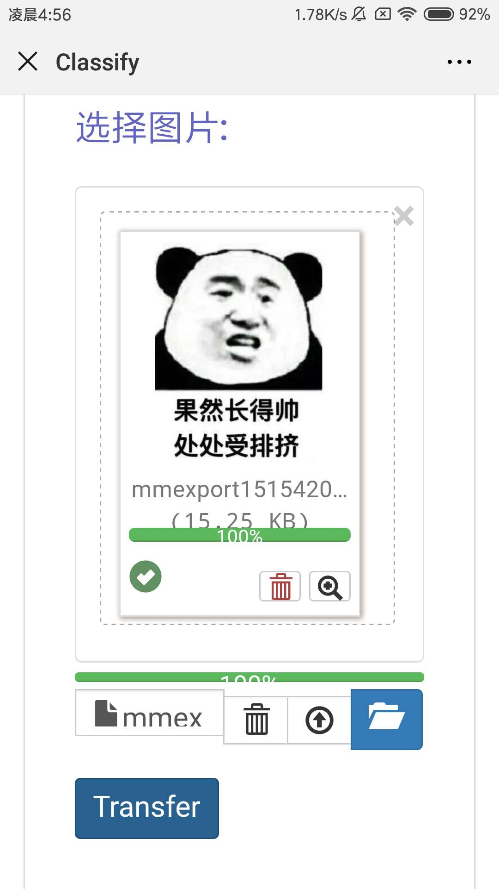
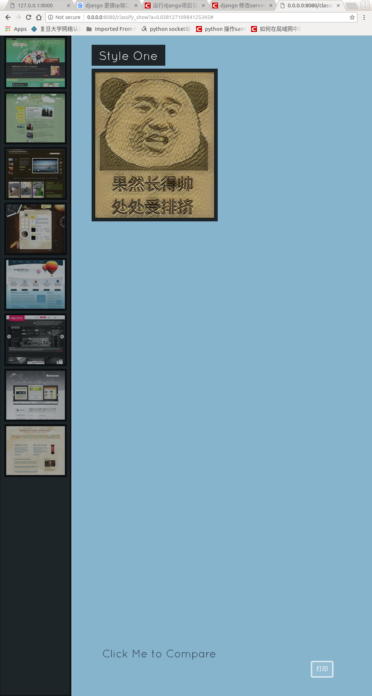

imageDB:
checkpoints装的是fast style transfer 的模型
input 是手机二维码扫描上传的图片
output  是模型训练完生成图片
QRcode  是存储二维码的位置
style_images 是标题栏的图片

使用方法:
去草料二维码生成一张自己电脑ip的二维码,然后放在QRcode中,将index.html
直接根据django的运行方式跑就可以但是要在0.0.0.0 下端口号是你草料生成的端口号
手机和电脑要在同一个局域网内

中的src换成生成的二维码的图片
把下面的模型放在 ImagesDB下面
链接: https://pan.baidu.com/s/1Xe2v79vaQvJT7clenRCBUg 密码 : qk7r基本的界面如下
主界面：

手机页面：

转换完后展示页面：

点击转换完的图片和原图对比页面：

